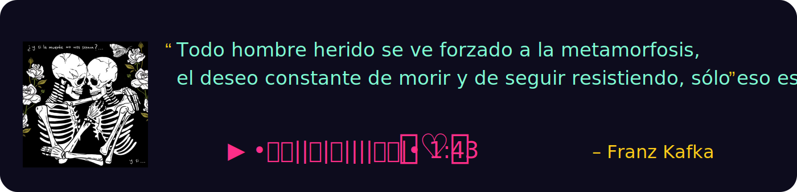

##  I'm a Computer science student at UTFSM  🂱 Skills & Practice  Basic programming in C#, C++ and Python. Constant curiosity! Always asking, learning and exploring!  🂲 Fun facts  - I like learning in community - I enjoy read and games

## 🌐 Socials:
  

# 💻 Tech Stack:
  
## all in 

---

  

